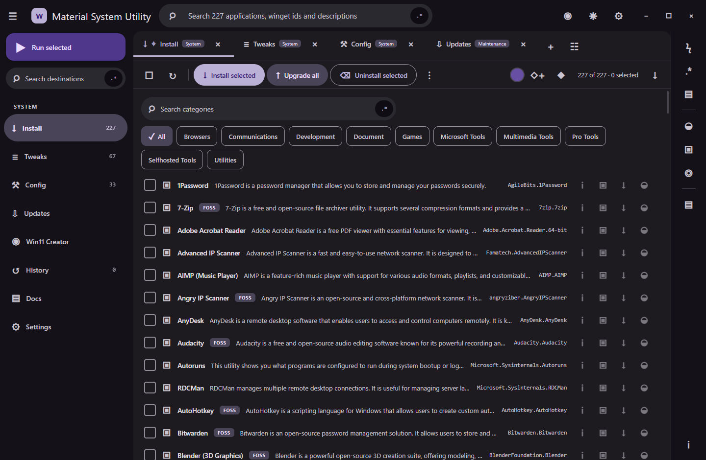

# Material System Utility

Material System Utility is a Windows desktop application that presents the
open-source WinUtil catalogue in a frameless Material Design 3 interface.

[Download the Windows x64 installer](https://github.com/Ding-Ding-Projects/material-winutil/releases/download/v0.1.0-build.6.1/MaterialSystemUtility-Setup.exe) · [Documentation site](https://ding-ding-projects.github.io/material-winutil/) · [Release notes](https://github.com/Ding-Ding-Projects/material-winutil/releases/tag/v0.1.0-build.6.1)

The installer is an unsigned Squirrel.Windows executable and may trigger an
unknown-publisher or SmartScreen warning.

> [!IMPORTANT]
> The first baseline enables only exact, allowlisted WinGet package operations.
> Tweaks, optional features, update profiles, AppX removal, ISO servicing, and
> other higher-risk operations fail closed until their reviewed adapters ship.

What this capture proves

This image was captured from the locally built application after the icon,
keyboard-focus, search-label, unsupported-action, and package-ID boundary repairs.
It shows the 227-entry catalogue, distinct toolbar and row affordances, exact package
identifiers, a frameless title bar, and the application running without touching the
operator's visible desktop.

Application update status

Installed builds check the public Squirrel.Windows feed on startup and every four
hours. The app shows current, checking, available, ready, up-to-date, and error
states without blocking work. A downloaded update stays staged until the user
chooses **Restart to install update**; all release installers remain unsigned.

## Build

Double-click `build.bat` on a fresh Windows installation. It installs Node.js LTS
when missing, installs the exact locked dependencies, verifies the Electron binary,
builds the app, then asks whether to run it. Automation uses `build.bat /s` and never
opens a window or waits for input.

The Windows installer is unsigned by permanent project policy and may trigger
an unknown-publisher or SmartScreen warning:

Double-click `build-installer.bat`, or run `build-installer.bat /s` without prompts.
It uses the same locked build, verifies `Setup.exe`, `RELEASES`, and the full `.nupkg`,
refuses a signed executable, and prints the setup path and SHA-256.

## Provenance

Catalogue data is derived from WinUtil at commit
`aee3e7a1f4a3249ff2f95e75b5bd3768626a21b6`. The complete upstream MIT notice
is retained in [THIRD_PARTY_NOTICES.md](THIRD_PARTY_NOTICES.md). This project
uses distinct branding and does not reuse upstream logos or screenshots.

## Current verification boundary

- The renderer is context-isolated and receives only named IPC methods.
- Package IDs are validated again in the main process.
- System operations without a reviewed adapter return an explicit unsupported result.
- The app bundles no remote fonts, analytics, credentials, sample history, or sample secrets.

Long-form feature documentation, release automation,
the landing page, real captures, and the remaining reviewed system adapters are part of
the active release-grade implementation and are not claimed complete by this baseline.
