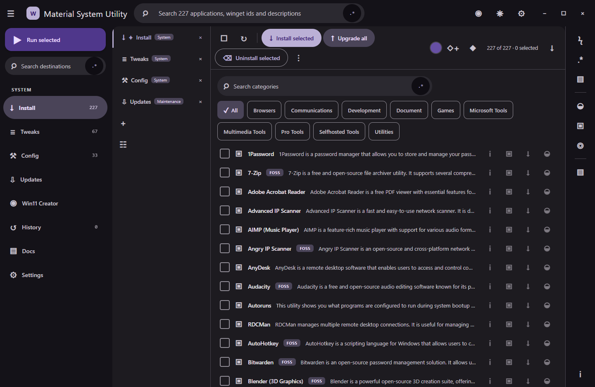
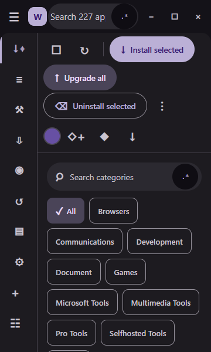
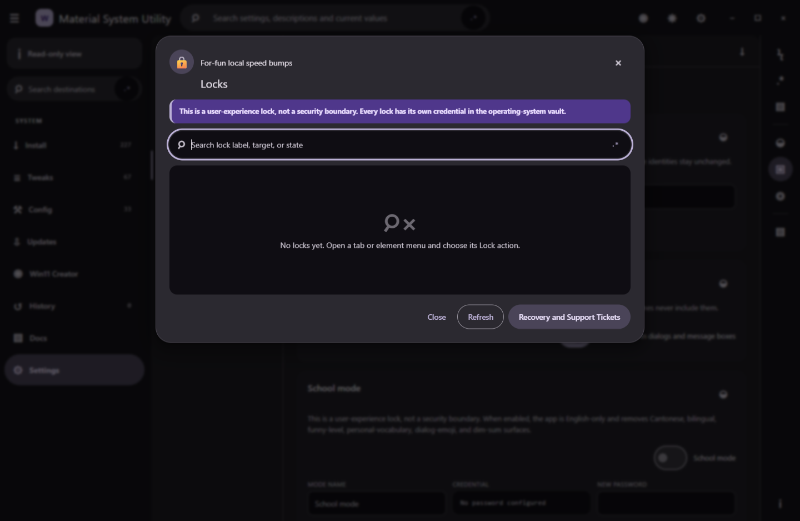
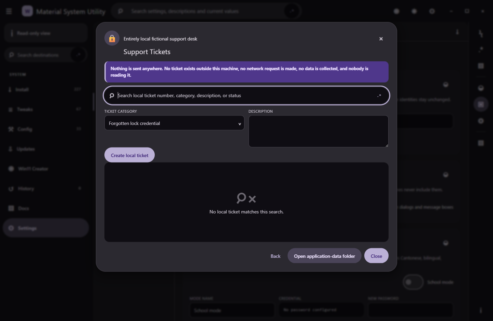
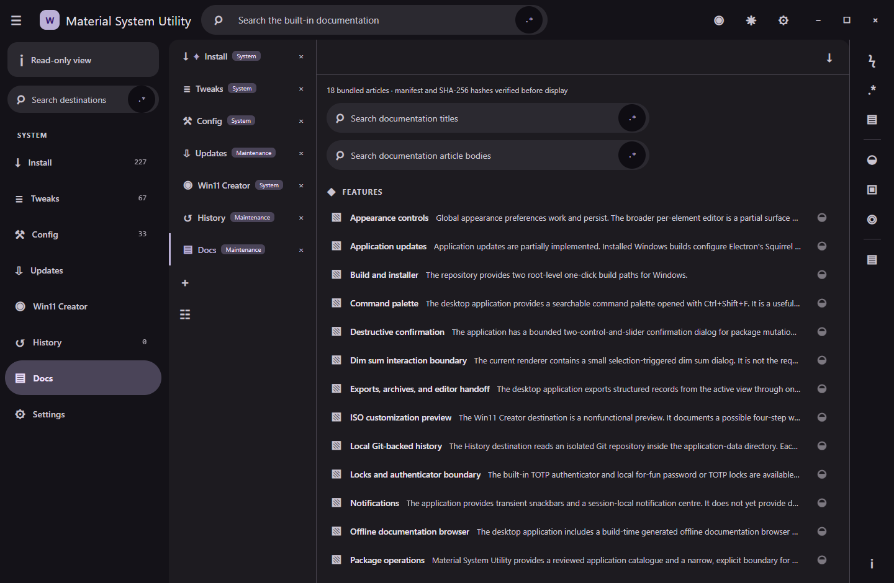
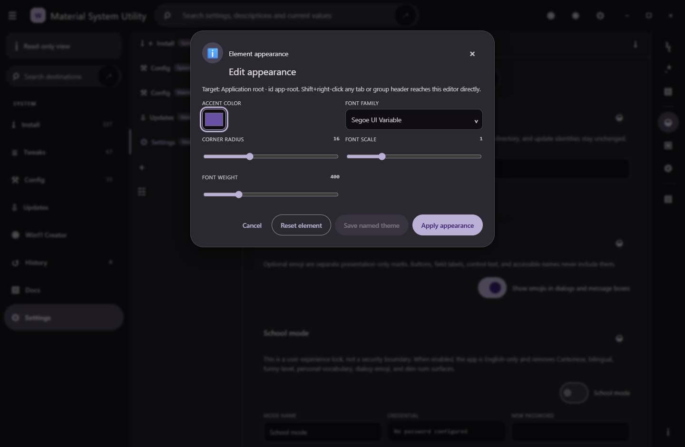
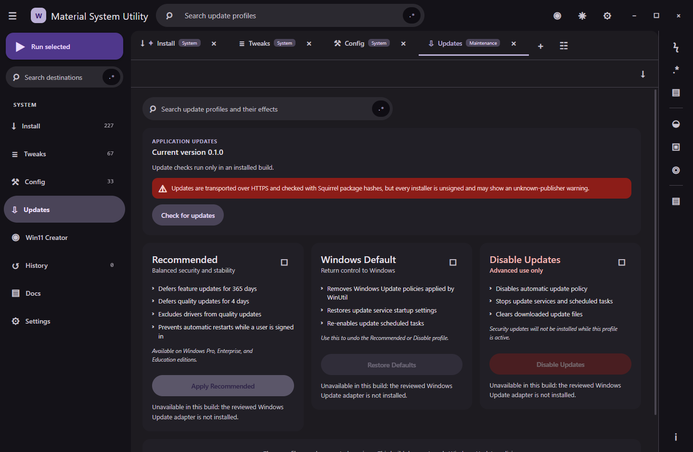

# Material System Utility

Material System Utility is a Windows desktop application that presents the
open-source WinUtil catalogue in a frameless Material Design 3 interface.

[Download the latest Windows x64 installer](https://github.com/Ding-Ding-Projects/material-winutil/releases/latest/download/MaterialSystemUtility-Setup.exe) · [Documentation site](https://ding-ding-projects.github.io/material-winutil/) · [Latest release notes](https://github.com/Ding-Ding-Projects/material-winutil/releases/latest)

The installer is an unsigned Squirrel.Windows executable and may trigger an
unknown-publisher or SmartScreen warning.

> [!IMPORTANT]
> Release `v0.1.0-build.6.1` enables only exact, allowlisted WinGet package operations.
> Tweaks, optional features, update profiles, AppX removal, ISO servicing, and
> other higher-risk operations fail closed until their reviewed adapters ship.

What this capture proves

This image was captured from the published `v0.1.8601` Squirrel full package at
commit `3de1bba97d9f59daaba1fe10e083158ef8760183`. It shows the 227-entry catalogue,
distinct toolbar and row affordances, exact package identifiers, a frameless title bar,
and the application running without touching the operator's visible desktop.

Release v0.1.8601 real capture gallery

All six captures below are genuine frames from the published unsigned Squirrel full
package at commit `3de1bba97d9f59daaba1fe10e083158ef8760183`, taken through the
project's hidden-desktop capture harness. The full 71-state matrix was decoded and
verified before this curated gallery was selected; it performed zero package commands,
zero completed confirmations, and zero visible-desktop interactions.

Application update status

Installed builds check the public Squirrel.Windows feed on startup and every four
hours. The app shows current, checking, available, ready, up-to-date, and error
states without blocking work. A downloaded update stays staged until the user
chooses **Restart to install update**; all release installers remain unsigned.

> [!WARNING]
> GitHub immutable releases are disabled for this repository. The unsigned update
> feed and release assets are therefore mutable by repository administrators.
> HTTPS and package hashes can detect corruption in transit, but they do not make
> the feed immutable or prove a publisher identity. Review the published SHA-256
> values before installing or restarting into an update.

## Build

Double-click `build.bat` on a fresh Windows installation. It installs Node.js LTS
when missing, installs the exact locked dependencies, verifies the Electron binary,
builds the app, then asks whether to run it. Automation uses `build.bat /s` and never
opens a window or waits for input.

The Windows installer is unsigned by permanent project policy and may trigger
an unknown-publisher or SmartScreen warning:

Double-click `build-installer.bat`, or run `build-installer.bat /s` without prompts.
It uses the same locked build, verifies `Setup.exe`, `RELEASES`, and the full `.nupkg`,
refuses a signed executable, and prints the setup path and SHA-256.

## Provenance

Catalogue data is derived from WinUtil at commit
`aee3e7a1f4a3249ff2f95e75b5bd3768626a21b6`. The complete upstream MIT notice
is retained in [THIRD_PARTY_NOTICES.md](THIRD_PARTY_NOTICES.md). This project
uses distinct branding and does not reuse upstream logos or screenshots.

## Current verification boundary

- The renderer is context-isolated and receives only named IPC methods.
- Package IDs are validated again in the main process.
- System operations without a reviewed adapter return an explicit unsupported result.
- The app bundles no remote fonts, analytics, credentials, sample history, or sample secrets.

Release `v0.1.8601`, its unsigned Squirrel.Windows assets, the documentation site,
workflow timing, line counts, and a verified 71-state capture matrix are published.
Installed-update end-to-end proof, reviewed system adapters, and the remaining universal
product contracts remain active work and are not claimed complete.
