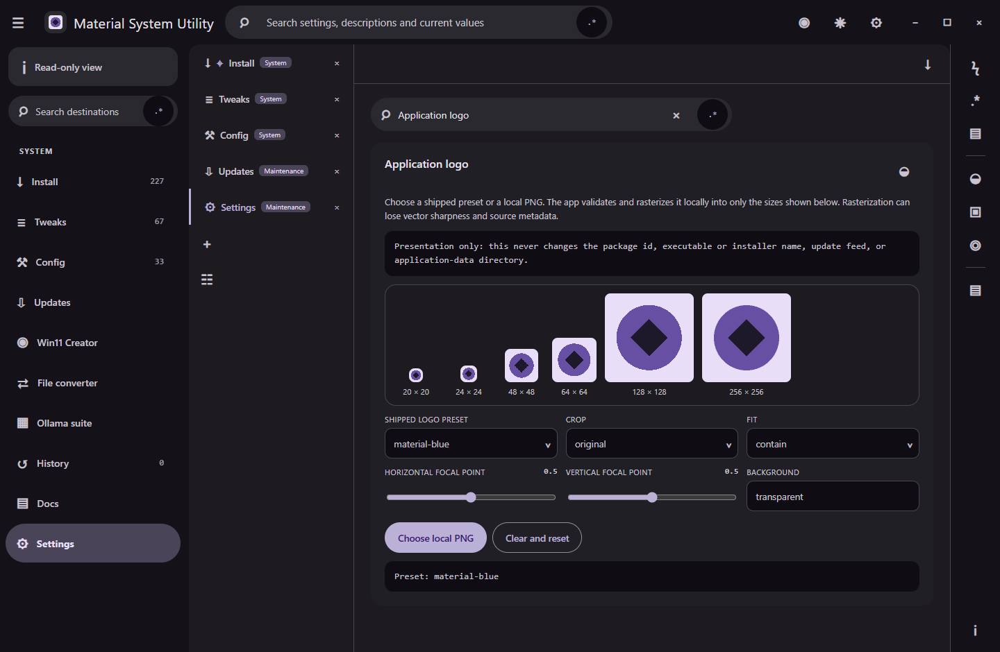

# App-logo customization

## Behavior

The Settings surface provides three shipped presentation presets and a semantic local PNG picker. A supplied image is structurally checked, CRC-decoded, bounded by upload/chunk/dimension/pixel limits, and rejected if it is animated, malformed, spoofed, or has trailing data. Crop, fit, focal-point, and background choices produce six declared PNG display sizes locally. The title bar consumes the 20-pixel result and Settings shows live previews of every consumed size.

Only a normalized `app-256` derived raster is eligible for persisted custom state. The selected source path, source filename, original source bytes, and source hash are omitted. Rasterization may lose vector sharpness and source metadata. The logo changes presentation only; it cannot alter package identity, the executable or installer name, the update feed, or application-data location.

## Configuration

Settings search indexes preset selection, local upload, crop, fit, focal point, background, status, and reset. The command palette opens Settings, filters to the exact logo card, and focuses its first control. English, Cantonese, and bilingual copy follow the active language mode. School mode omits the entire logo surface and palette command while preserving the prior local selection for restoration after unlock.

## Failure modes

The prior valid logo remains selected when a new upload fails validation. Unsupported formats, invalid PNG structure, animation, malformed CRCs, resource-limit breaches, and tampered persisted data fail closed. A corrupt persisted record resets to the shipped Material blue preset.

## Security considerations

The renderer receives only validated derived assets and presentation metadata through named trusted IPC. It never receives the selected source path, file name, source bytes, or source hash. The feature performs no network or PATH lookup and emits no logo into history, export, logs, telemetry, prompts, captures, or public records. A personal logo is not package or installer provenance; the committed native application icon remains the installed identity.

## Verification

`scripts/tests/app-logo.test.mjs`, `scripts/tests/app-logo-service.test.mjs`, and `scripts/tests/app-logo-surface-integration.test.mjs` cover presets, structural/decode limits, spoofing/animation/bomb rejection, transforms and all output sizes, derived-only persistence, corrupt-state recovery, export omission, IPC parity, Settings/search/palette/title-bar wiring, and stable identity. The smoke manifest declares a deterministic logo Settings state for packaged hidden-desktop capture.

## Suggested articles

- [Appearance controls](appearance-controls.md)
- [Build and installer](build-and-installer.md)
