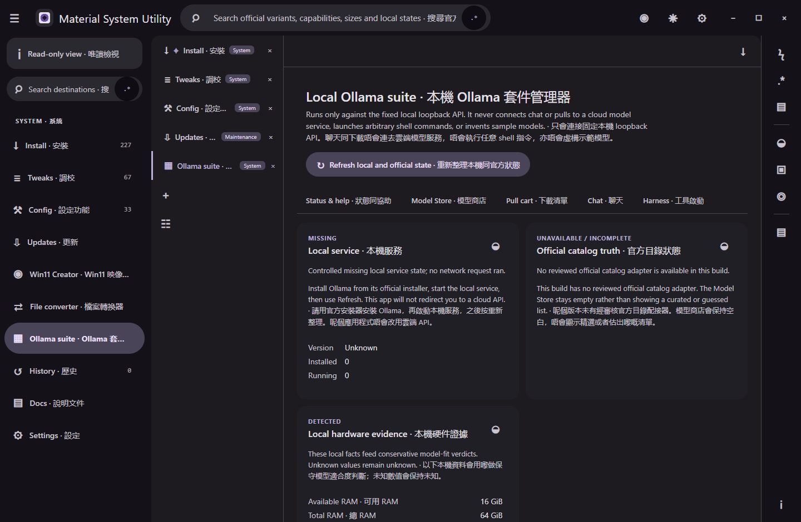
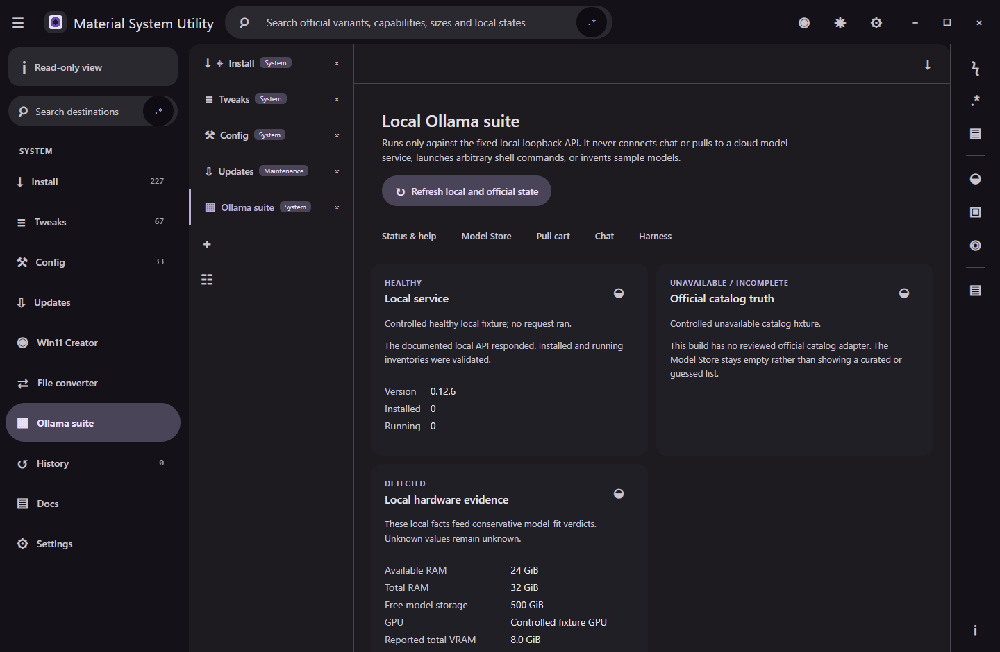

# Local Ollama suite manager

The desktop application provides a guided local Ollama manager with a bounded Model Store, local-service health, a pull cart, chat, and allowlisted harness planning. It intentionally does not execute shell commands, connect to hosted model services, invent sample models, scrape an undocumented catalogue, or claim that Ollama launches third-party harnesses.

## Local service boundary

The service accepts only the exact `http://127.0.0.1:11434` origin and the documented routes `/api/version`, `/api/tags`, `/api/ps`, `/api/pull`, and `/api/chat`. Redirects, credentials, query strings, arbitrary paths, hostname aliases, cloud endpoints, and user-entered base URLs are rejected. Responses, streams, names, histories, queues, and persisted records have explicit byte and item limits.

Health combines a validated version, installed-model inventory, and running-model inventory. A refused connection is reported as missing; a malformed or unhealthy service is kept distinct. Each local request has a 15-second request-and-body deadline, so an unresponsive local service cannot hold the surface indefinitely. Pulling uses only `POST /api/pull`, never a CLI or shell, with two concurrent workers, 128 queued items, a 15-second request deadline, a two-minute idle-stream deadline, a six-hour overall deadline, cancellation, retry, partial outcomes, and atomic durable queue state. A user cancellation remains distinct from a timeout.

Chat uses only `POST /api/chat`. Model identity must match a verified catalogue variant; history, messages, images, and generation parameters are bounded. Image attachments are accepted only for a variant whose verified capabilities include vision. Cancellation aborts the active local request, and its 15-second request, two-minute idle-stream, and 15-minute overall deadlines clean up the reader before a later chat can begin. Exports omit the system prompt, omit attachment data, and redact common credential assignments.

## Official catalogue and fit evidence

The catalogue adapter is deliberately separate from the core parser so the desktop UI does not embed an undocumented scraper in privileged code. Every page must identify the official source, one stable source revision, its exact page number and URL, the next official URL, and each published variant. A page has a 20-second deadline and the complete refresh has a two-minute deadline. Refresh follows every page up to explicit safety limits, detects cycles and duplicates, records completeness/page count/timestamp/revision, and falls back offline to a previously validated cache marked stale. Until a reviewed adapter is supplied, the Model Store displays its explicit unavailable or stale state rather than inventing entries. Installed models remain independently available from the local API.

Fit verdicts are `Runs well`, `Runs with limits`, `Unlikely`, or `Unknown`. The calculation uses exact blob size, parameter count, quantization, context overhead, detected available RAM, VRAM, supported accelerator state, driver evidence, and free disk. A model name never affects the verdict. Missing facts produce `Unknown`; insufficient disk or memory produces `Unlikely`. `Runs well` requires explicit supported-accelerator evidence and sufficient available VRAM rather than treating absent GPU evidence as success.

The installed Windows application collects local hardware evidence through a main-process-only adapter. RAM uses Node's operating-system byte counters. Free storage uses the file system that contains the default local Ollama model directory. GPU identity, reported total adapter memory, and driver version come from a fixed `Win32_VideoController` query launched through the absolute system PowerShell path with no shell expansion, no PATH discovery, no renderer-controlled command, a 5-second deadline, and a 256 KiB combined-output limit. Output is strict bounded JSON. Malformed, oversized, timed-out, missing, or unsafe values stay unavailable and never become zero. `AdapterRAM` is only advisory total VRAM: available VRAM and Ollama accelerator support remain `Unknown` until a stronger documented local source can prove them.

## Harness boundary and failure modes

Harness preparation is an allowlisted typed plan, not arbitrary process execution. Only the shipped `vscode-continue`, `opencode-local`, and `open-webui-local` profiles exist. The desktop picker presents semantic choices, fit preflight, a preview, and restore controls. A plan accepts fixed executable identifiers, fixed arguments, and fixed loopback environment keys; it always includes a configuration snapshot and requires rollback on failed launch. Launch remains disabled until a reviewed installed-executable detector and rollback executor are available. Those paths must keep secrets out of arguments, environment, snapshots, and logs.

Failure is fail-closed: invalid inventories, unofficial sources, incomplete pagination, duplicate variants, unknown payload fields at integration boundaries, unsupported attachments, oversized content, arbitrary commands, unverified model names, and expired local requests cannot mutate state or start work. Catalog refresh is single-flight and retains the last validated cache if a page deadline expires. The desktop surface includes guided Material Design controls, troubleshooting, localized hardware evidence with explicit `Unknown` values, a Model Store regex search, a bounded pull cart, chat, and harness planning. A reviewed official-catalog adapter, native attachment/export handoff, executable detection/launch/rollback, and current packaged interaction evidence remain documented boundaries.

## Verification

`scripts/tests/ollama-suite.test.mjs` covers strict loopback routing, official catalogue validation and pagination, offline stale fallback, evidence-driven fit, local health, request/body/stream deadlines, single-flight refresh, timeout-versus-user-cancellation behavior, bounded pull API behavior, streaming chat, export redaction, attachment capability rejection, and allowlisted rollback plans. `scripts/tests/ollama-hardware-service.test.mjs` covers strict GPU parsing, main/preload/renderer integration, partial RAM/disk success, invalid counters, non-Windows unavailability, fixed executable arguments, and malformed or oversized output. Negative regressions reject cloud URLs, URL aliases, arbitrary paths, uncatalogued models, unsupported parameters, arbitrary shell fields, custom executable profiles, optimistic `Runs well` verdicts without explicit supported-accelerator and available-VRAM evidence, and stalled requests that would replace valid stale catalogue data.

## Suggested articles

- [Workspace and search](workspace-and-search.md)
- [Scheduled settings](scheduled-settings.md)
- [Offline documentation](offline-documentation.md)
